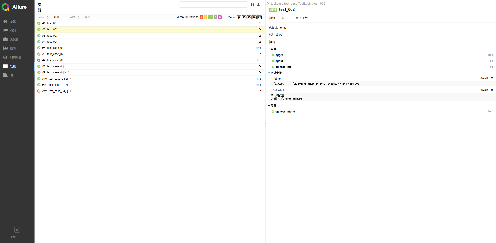

<div style="font-family: 'Kanit', sans-serif;text-align: center;border: 10px solid #fff;box-shadow: 1px 1px 2px #e6e6e6;background: linear-gradient(to left top, #11998e, #38ef7d); padding: 50px 0;">
<div style="color: #fff;">
    <h3 style="font-size: 25px;font-weight: 600;letter-spacing: 1px;text-transform: uppercase;margin: 0;">
       Python UI Automation Test Init
    </h3>
    <span style="font-size: 16px;text-transform: capitalize;">
    	Python UI自动化测试初始化框架
    </span>
</div>
</div>

## 简介 Introduction

- 本库包含的代码封装了UI自动化测试的基本框架，使用 python + selenium + pytest

## 项目结构
```
common -------------- 常用公共方法
    |-- __init__.py
    |-- email
    |-- log
    |-- selenium
config -------------- 配置文件
    |-- __init__.py
    |-- system_config.ini
    |-- manager_config.py
    |-- read_config.py
logs --------------- 日志文件
model -------------- 模型层，包含一些实体类和枚举类
    |-- __init__.py
    |-- entity
    |-- enum
resource ------- 资源文件
    |-- driver web driver 存放路径
    |-- img  图片存放路径
    |-- screenshot  运行截图存放路径
    |-- report  测试报告
test -------------- 测试用例
    |-- __init__.py
    |-- case  测试case
    |-- page  PO模式页面对象
utils -------------- 工具类
    |-- __init__.py
    |-- id
    |-- internet
    |-- selenium
    |-- time
conftest.py -------- pytest配置文件
pytest.ini --------- pytest配置文件
requirements.txt --- 依赖包
```

## 代码框架 Code Framework

loguru~=0.7.3

selenium~=4.29.0

pyperclip~=1.9.0

webdriver-manager~=4.0.2

dotenv~=0.9.9

python-dotenv~=1.0.1

pytest==8.3.5

pytest-html==3.1.1

pytest-timeout==2.3.1

allure-pytest==2.14.0


## 使用方法 Usage

首先，下载项目源码后，在根目录下找到 requirements.txt 文件，然后通过 pip 工具安装 requirements.txt 依赖，执行命令：

```bash
pip3 install -r requirements.txt
```
接着，修改 config/system_config.ini 配置文件。

如果你需要使用自己下载的webDriver则需要把WebDriver文件放到 resource/driver目录中，并修改config/system_config.ini中的 driver 配置项
```ini

在Windows环境下，安装相应依赖之后，在命令行窗口执行命令：

```bash
pytest -v
```

## 测试报告
在命令行执行命令：pytest -v 运行用例后，会得到两种不同的测试报告的原始文件：
- resource/report/report.html：可以预览的html文件
- resource/report/report-json：allure格式的测试报告

allure格式的测试报告是不能打开成HTML的报告，还需要在项目根目录下，执行命令启动 allure 服务：

需要提前配置allure环境，才可以直接使用命令行
```bash
allure serve ./report-json
```
最终，可以看到测试报告的效果图如下：
